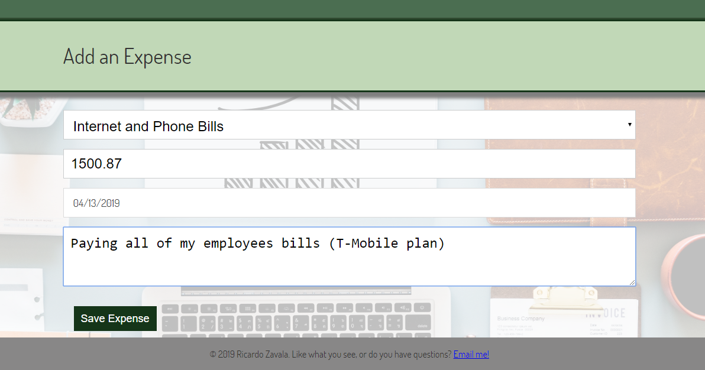
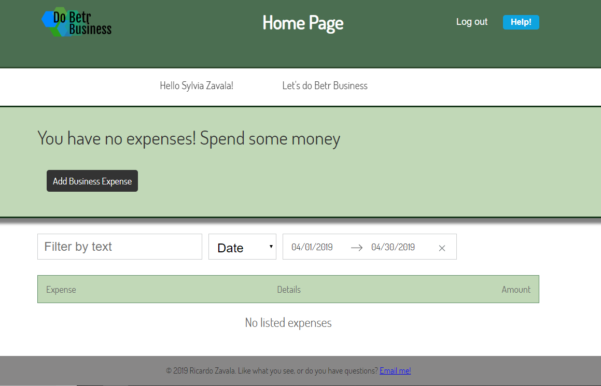
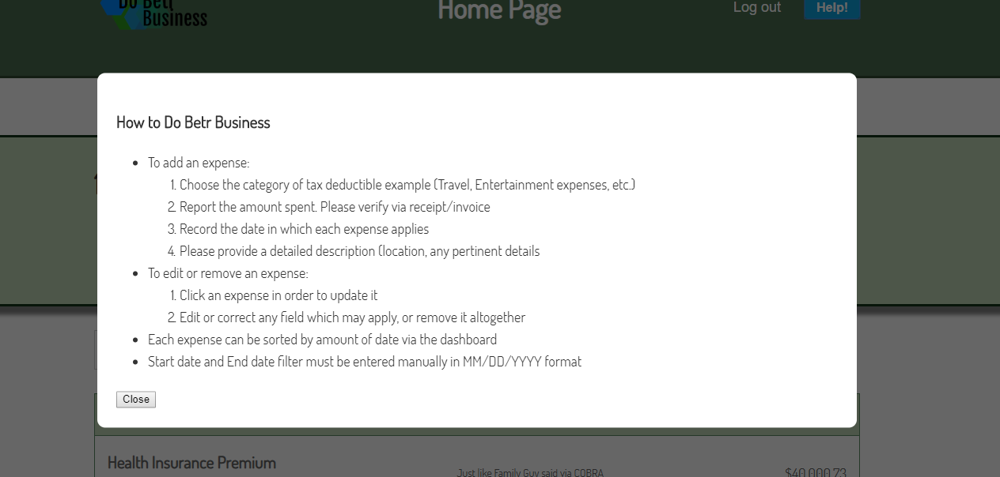

# Do Betr Business

A fullstack javascript application that helps business and self-employed professionals to easiliy keep track of and tax deductible expenses

* Create - Add expenses
* Read   - Get a list of all expenses and details
* Update - Update expense info
* Delete - Delete expenses 

## Demo

- [Live Demo](https://desolate-taiga-15973.herokuapp.com/)

## Motivation

As a prospective future entrepreneur I figured that it would be a great idea to create an extremely simple app to keep track of expenses so that users can stay on top of every little expense. Once tax season comes, people tend to forgot some of their expenses. This app can apply to a Fortune 500 executive or an indepedent contracter such as an Uber driver 

## Built With
*The client and API were deployed separately and stored in separate GitHub repos.* 
- [DBB API Repo](https://github.com/rzavala1989/betr-business-server)

### Front End
* HTML
* CSS
* JavaScript [ES6]
* React

### Back End
* Node.js
* Express
* Mongo
* Mongoose
* JWT Authentication
* bcryptjs
* Passport
* Mocha
* Chai

### DevOps
* Heroku
* TravisCI
* mLab

## Screenshots

Landing:

Registration:

Dashboard:

Add Expense:

Edit Expense:

Delete Expense:

Help Modal:

## Using the API

### Authentication / Login
##### POST &nbsp;&nbsp;&nbsp;&nbsp;&nbsp;&nbsp; /api/auth/login

* Bearer Authentication with JSON Web Token
* Must supply valid Username and Password in request header
* If authentication succeeds, a valid 7d expiry JWT will be provided in response body

### Register New User
##### POST &nbsp;&nbsp;&nbsp;&nbsp;&nbsp;&nbsp; /api/users 

* Must supply First name, Last name, Username and Password in request body
* If successful, a valid 7d expiry JWT will be provided in response body

### Get All Expenses
##### GET &nbsp;&nbsp;&nbsp;&nbsp;&nbsp;&nbsp; /api/expenses

* This endpoint retrieves all expenses from user database
* Must supply valid JWT via Bearer Authentication
* If authentication succeeds, all expenses will be returned

### Add Expense
##### POST &nbsp;&nbsp;&nbsp;&nbsp;&nbsp;&nbsp;/api/expenses

* This endpoint adds a single expense to user database
* Supply expense object in request body
* Must supply valid JWT via Bearer Authentication

### Update Expense
##### PUT &nbsp;&nbsp;&nbsp;&nbsp;&nbsp;&nbsp;/api/expenses/{PROPERTY-ID-GOES-HERE}

* This endpoint updates a single expense in user database
* Supply expense ID as route parameter
* Supply expense object in request body
* Must supply valid JWT via Bearer Authentication

### Delete Expense
##### DELETE &nbsp;&nbsp;&nbsp;&nbsp;&nbsp;&nbsp;/api/expenses/{PROPERTY-ID-GOES-HERE}

* This endpoint deletes a single expense from user database
* Supply expense ID as route parameter
* Must supply valid JWT via Bearer Authentication

